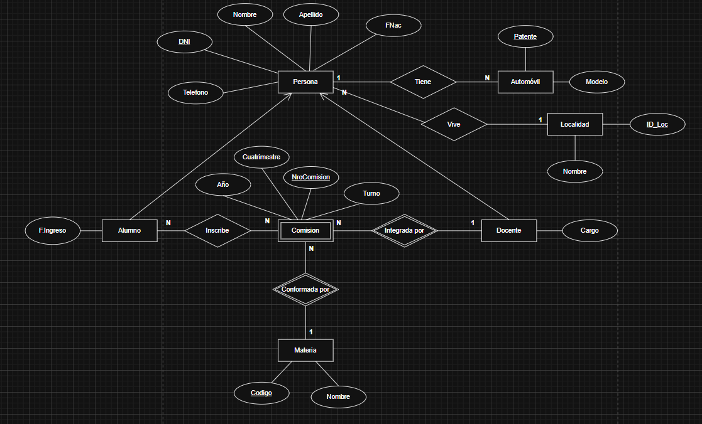

# TP Nro 1 Base de Datos Aplicada

## Integrantes

- GONZÁLEZ FERNÁNDEZ, IVÁN ALEJANDRO
- LORENZANA, AGUSTÍN NICOLAS
- MANZANO, FEDERICO
- RODRIGUEZ CHRISTIAN MARTIN

Trabajo práctico número de de Bases de Datos Aplicada, equipo: [SQL Wrriors](https://github.com/SQL-Warriors/TP_1_Base_De_Datos_Aplicada)

## Diseño de la base de datos



## Creación de elementos en orden 

```SQL
/*
    CREACIÓN DE ELEMENTOS:

    TABLAS SCHEMA ddbba 
    /tb/tb_Registro.sql
    /tb/tb_Persona.sql
    /tb/tb_Alumno.sql
    /tb/tb_Docente.sql
    /tb/tb_apyn.sql

    PROCEDIMIENTOS ALMACENADOS SCHEMA ddbba 
    /sp/random/sp_cadena_random.sql
    /sp/random/sp_cadena_random_letras.sql
    /sp/random/sp_generar_dni_random.sql
    /sp/random/sp_get_nombre.sql
    /sp/random/sp_get_apellido.sql
    /sp/random/sp_generar_1100_personas.sql
    /sp/sp_insertar_log.sql

    TEST SCHEMA test
    /test/test.sql Para crear el esquema test 
    /test/test_cad_random.sql TODAS LAS PRUEBAS EL SP ddbba.sp_Cadena_Random
*/
```

## Esquemas

```SQL
EXEC('CREATE SCHEMA ddbba') -- Esquema del dominio de problema
EXEC('CREATE SCHEMA test') -- Esquema de test unitarios
```

## Tablas

[PATH Tablas](tb/)

```SQL
-- BITÁCORA

/**
    Tabla Registro cumplirá la función de simular una bitácora (Log) cuando 
    existan modificaciones en los datos de las tablas.
*/
IF NOT EXISTS (SELECT * FROM INFORMATION_SCHEMA.TABLES WHERE TABLE_NAME = 'ddbba.Registro')
BEGIN
    CREATE TABLE ddbba.Registro 
    (
        IdRegistro INT IDENTITY(1,1) PRIMARY KEY,
        Fecha_y_Hora DATETIME DEFAULT GETDATE(), -- En cada inserción se carga en este campo la fecha y la hora actual
        Texto VARCHAR(50),
        Modulo VARCHAR(10),

        -- Restricción explícita: Campo texto solo puede tener hasta 50 caracteres
        CONSTRAINT CK_Texto CHECK
        (
            LEN(Texto) <= 50
        ),

        -- Restricción explícita: Campo modulo solo puede tener hasta 10 caracteres
        CONSTRAINT CK_Modulo CHECK 
        (
           LEN(Modulo) <= 10
        )
    )
END 
```


